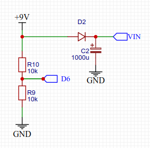

## TDA7439_audioprocessor v 1.0

Модуль для работы с аудиопроцессором TDA7439, построенный на **Arduino Uno/nano/pro mini** (**ATmega168/328**)

- [Описание TDA7439](#описание-tda7439)
- [Описание модуля](#описание-модуля)
  - [Индикация](#индикация)
  - [Управление](#управление)
- [Настройки прошивки](#настройки-прошивки)
- [Используемые библиотеки](#используемые-библиотеки)


### Описание TDA7439

**TDA7439** – регулятор громкости и трехполосный регулятор тембра, разработанный для использования в HI-FI аппаратуре и качественных автомобильных аудиосистемах, обладает низким уровнем шумов и искажений.

Основные технические характеристики ИМС TDA7439:

- Громкость 48 уровней от -48 до 0 дБ;
- Регулировка тембра НЧ, СЧ, ВЧ  ±14 дБ (±7 уровней);
- Коммутация входов — 4 стерео канала;
- Предусиление от 0 до 30 дБ (с шагом 2 дБ), независимое для каждого канала;
- Регулировка баланса ±28 дБ (ограниченно программно);
- Напряжение питания от 6 до 10,2 В (типовое значение 9 В);
- КНИ на частоте 1 кГц не более 0,01%;
- Управление осуществляется по шине **I2C**;

### Описание модуля

Модуль позволяет выбирать вход и настраивать параметры звука. Параметры тембра, баланса и предусиления сохраняются для каждого входного канала в **EEPROM**.

Модуль позволяет указывать количество используемых входов, а так же позволяет использовать Bluetooth трансмиттер на любом из используемых входов.

#### Индикация

Модуль выводит данные на текстовый **LCD1602**-экран. Кроме того используется светодиод для индикации режима **MUTE** (мигает, если звук отключен), а так же, если ипользуется Bluetooth трансмиттер, светодиод для индикации его работы (включается, если выбран канал с трансмиттером).

#### Управление

Модуль управляется одним энкодером:

- поворот рукоятки регулирует текущий параметр (по умолчанию регулируется громкость);
- клик кнопкой энкодера перебирает параметры для регулировки:
  - громкость (**Volume**);
  - тембр НЧ (**Bass**);
  - тембр СЧ (**Middle**);
  - тембр ВЧ (**Trebble**);
  - баланс (**Balance**);
- двойной клик кнопкой энкодера переводит модуль в режим настройки уровня предусиления входа (**InputGain**);
- удержание нажатой кнопки энкодера отключает звук;
- поворот рукоятки с нажатой кнопкой энкодера позволяет выбрать текущий вход

Внесенные изменения в настройки параметров сохраняются через пять секунд после последней манипуляции энкодером. После десяти секунд отсутствия активности пользователя модуль переходит в режим по умолчанию (регулировка громкости). Экран при этом гаснет;

### Настройки прошивки

Все настройки собраны в начале файла **header_file.h**.

`#define NUMBER_OF_INPUT_IS_USED 4` - количество используемых входов; можно задать значение в интервале 1..4; если задать 0, компилятор выдаст ошибку, если задать более 4, все равно будут использоваться 4 входа (больше и нету);

`#define USE_BT_MODULE 4` - здесь указывается, на каком входе подключен Bluetooth трансмиттер; если задан канал с трансмиттером, модуль будет выводить на экран вместо номера канала сокращение **Bt**; кроме того, при выборе заданного входа будет включаться питание трансмиттера; если задать 0, трансмиттер использоваться не будет;

`constexpr uint32_t TIMEOUT_OF_RETURN_TO_DEFMODE = 10;` - таймаут возврата в режим по умолчанию при отсутствии активности пользователя в секундах;

`constexpr uint32_t TIMEOUT_OF_AUTOSAVE_DATA = 5;` - таймаут задержки сохранения параметров в **EEPROM**, в секундах;

`constexpr bool INT_PULLUP_OF_ROTARY_PINS = true;` - используется внутренняя подтяжка пинов к **VCC**, установите **false**, если ваш модуль энкодера использует внешнюю подтяжку;

`constexpr uint8_t BT_CONTROL_LEVEL = HIGH;` - управляющий уровень для включения питания Bluetooth трансмиттера;

Пины для подключения энкодера:
```
constexpr uint8_t ENC_A_PIN = 3;  - пин A энкодера (DT)
constexpr uint8_t ENC_B_PIN = 4;  - пин B энкодера (CLK)
constexpr uint8_t BUTTON_PIN = 2; - пин кнопки энкодера (SW)
```

`constexpr uint8_t BT_POWER_PIN = 5;` - пин для управления питанием Bluetooth трансмиттера;

`constexpr uint8_t BT_LED_PIN = 8;` - пин светодиода - индикатора включения Bluetooth трансмиттера;

`constexpr uint8_t MUTE_LED_PIN = 9;` - пин светодиода - индикатора режима **MUTE**;

`constexpr uint8_t VOLTAGE_CONTROL_PIN = 6;` - пин для контроля пропадания напряжения питания; используется для включения режима **MUTE** при отключении питания, чтобы избежать щелчка в колонках; примерная схема подключения:



***

### Используемые библиотеки

**Rotary.h** - https://github.com/brianlow/Rotary<br>
**LiquidCrystal_PCF8574.h** - https://github.com/mathertel/LiquidCrystal_PCF8574<br>
**shButton.h** - https://github.com/VAleSh-Soft/shButton<br>
**shTaskManager.h** - https://github.com/VAleSh-Soft/shTaskManager<br>

***

Если возникнут вопросы, пишите на valesh-soft@yandex.ru 


